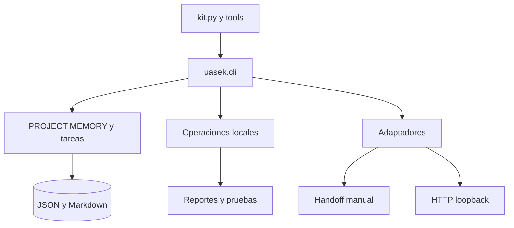

# Componentes

```mermaid
flowchart TD
  CLI[kit.py y tools] --> Dispatch[uasek.cli]
  Dispatch --> Memory[PROJECT MEMORY y tareas]
  Dispatch --> Ops[Operaciones locales]
  Dispatch --> Providers[Adaptadores]
  Memory --> Files[(JSON y Markdown)]
  Ops --> Reports[Reportes y pruebas]
  Providers --> Manual[Handoff manual]
  Providers --> Ollama[HTTP loopback]
```

Ver [manual de usuario](../user-manual/MANUAL.md) y [manual técnico](../technical-manual/MANUAL.md).
